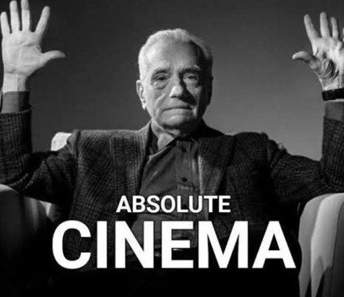

<div align="center">

# Cinema meme



[](LICENSE)
[](https://github.com/EvanGruhlkey/cinema/stargazers)

[Run locally](#run-locally) · [How it works](#how-it-works)

</div>


---

A single-page tool built around the Martin Scorsese reaction image: set custom top and bottom lines, optionally replace the face with your own photo, and download the result.

---

## Run locally

**Recommended:** use the included server so head background removal can run (it sets headers the ONNX runtime expects):

```bash
cd cinema
python serve.py
```

Open **http://127.0.0.1:8765/**

Plain `python -m http.server 8765` still runs the app, but face **background removal may fall back** to the original photo without transparency.

Rebuild the removal bundle after changing dependencies:

```bash
npm install
npm run build:bg
```

That writes `assets/remove-bg.mjs` (committed so `git clone` works without Node). Serving over HTTP avoids canvas export issues with `file://`.

---

## How it works

1. **Base image** — `assets/base.png` is the uncaptioned frame.
2. **Text** — Canvas renders bold Arial-class text with configured tracking and line spacing.
3. **Head** — An uploaded image is composited beneath the text, clipped to an ellipse; editing chrome (dashed outline and handle) is omitted on export.
4. **Download** — Produces a PNG without the editing overlay.

### Assets

| File | Role |
|---|---|
| `assets/base.png` | Source image without caption text. |
| `assets/meme.png` | Reference image with the original caption (optional comparison). |
| `index.html` | Single-file application (markup, styles, script). |

---

## Tips

- **Face alignment** — Position the ellipse first, then resize so facial features sit naturally in the frame.
- **Long captions** — Text scales to fit; very long strings may become small; split manually across two lines if needed.
- **Reference** — Compare output to `meme.png` to judge caption size and vertical placement.

---

## Tech

- HTML, CSS, and JavaScript only; no build toolchain.
- Canvas 2D for drawing, clipping, and text.
- Pointer events for drag and resize on the preview (mouse and touch).
